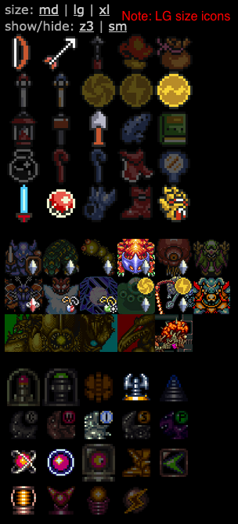

# smz3tracker

A simple tracker for Super Metroid / Link To The Past Combo Randomizer

Tested in Firefox and Safari. I'm guessing it should work in modern IE browsers, but it's Microsoft so...

Plans:
- brainstorm ways to eliminate everything but tracking eg no menu at top, no buttons for show/hide
-- purpose: help streamers in showing in their stream program
-- issue with browser toolbars always being visible
- passive items in 3rd column
- rods 1/2 width
- combine other things into one square eg mushroom/powder
- other combinations and/or feedback of important things to track

